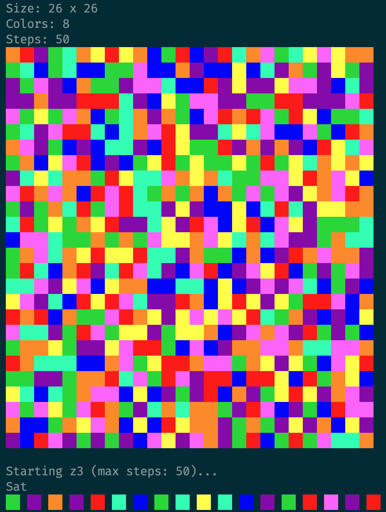

# Flood it SAT solver

Solving ``Flood it'' [0] [1] like puzzles via [z3][2].



## Build
```sh
cargo build --release
```

## Usage

### Find optimal solution by binary search
```sh
./color-flood-rs < input.txt
```

### Find optimal solution in fixed range by binary search 
```sh
./color-flood-rs [lo] [hi] < input.txt
```

### Find solution with fixed number of steps
```sh
./color-flood-rs [steps] < input.txt
```

[0]: https://unixpapa.com/floodit
[1]: https://www.janko.at/Spiele/Farbflutung
[2]: https://github.com/Z3Prover/z3